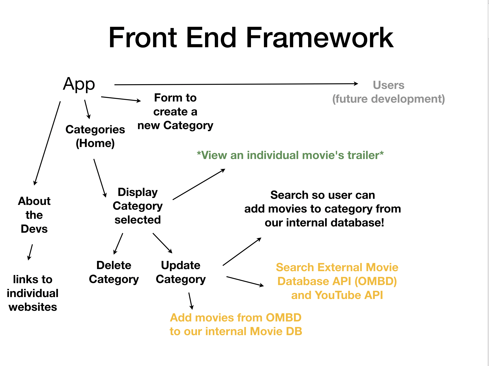
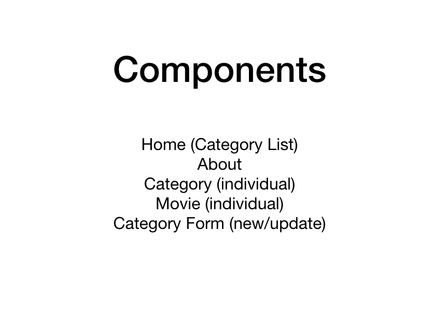

# trailerTracker

## Description

The Trailer Tracker app was created to let users search an extensive database of movies, and organize them into _any_ kind of category that the user wants to create.

- Favorite Movies
- Happy Movies
- Action Movies
- And More!

## Features

The app features the following main pages; Home, About, and New Category in navigation, and Update Category, Show Movie Trailer within the individual Category page.

- The Home page displays a customizable list of the categories that the user has chosen to group their chosen movies in. Once inside one of the categories, useres can click on a movie poster to be transported to the trailer for the chosen movie. Users can also delete that category, and update that category with movies from the database.

- The About page is a biographical page about the development team.

- The New Category page is where users can choose a name for their new category, search the database for movies that they like, then populate the category with their movies.

- The Update Category page allows users to search through our local database and add movies to existing categories.

- From the Category List on the homepage, you can select any single movie in that category and watch the trailer.

## Planning

> ## Wireframe Images
>
>  >  > 

## Our Process

The team initially decided to split into pairs and to divide the front end and back end duties evenly between the pairs.
After intitial setup of front-end and backend team members divided evenly on both fron-end and backend tasks.

Some code snippets we are particularly proud of:

Our searched movies from the OMBD database returns the title and the release year, so to add ONLY the title, we created this clever piece of code.

```
addSearchedMovie(evt) {
        evt.preventDefault(evt);
        console.log(evt.target.innerText);
        evt.target.style.color = '#F25A38';
        let newMovieTitle = evt.target.innerText;
        newMovieTitle = newMovieTitle.split("");
        for (let i = 0; i < 5; i++) {
            newMovieTitle.pop();
        }
        newMovieTitle = newMovieTitle.join("");
        console.log(newMovieTitle);
        let newMovieObject = this.state.searchedMovieList;
        console.log(newMovieObject);
        axios.get(`https://trailerstracker.herokuapp.com/Movie/new/${newMovieTitle}`)
            .then(res => {
                // this.setState({movies: [...this.state.movies] } );
                window.location.reload();
                // console.log(newMovieObject);
                // console.log(res);
            })
    }
```

We also needed a way to add movies from our local database stored in Heroku which we did with these two pieces of code:

Look for the movie in our database

```
searchResults(evt) {
        evt.preventDefault();
        let foundMovie = this.state.foundTitle;
        axios.get(`https://trailerstracker.herokuapp.com/Movie/search/${foundMovie}`,
            { title: foundMovie},
            { headers: { 'Content-Type': 'application/json' } })
            .then(res => {
                this.setState({searchedMovieList: res.data.Search} );
                // console.log(res.data.Search);
            });
    }
```

Find by typing in the search field and filtering the titles down by the characters included.

```
findMovie(evt) {
        this.setState({ search: evt.target.value });
        //console.log(evt.target.value);
        let filteredMovie = this.state.originalMovieList.filter(
            (movieTitle) => movieTitle.title.toLowerCase().includes(evt.target.value.toLowerCase()));
        this.setState({ movieList: filteredMovie });
        console.log(filteredMovie);
    }
```

## Technologies Used

The front end of the app was built with:

- HTML
- React.js
- Axios
- CSS
- Bootstrap (styling)

The backend repo is hosted on GitHub at https://github.com/dctalk1234/trailer-tracker-backend

The app was tested with Postman, GitHub was used for version control, and deployment was via Heroku and github pages

## Current Version
You can see the most recently updated deployed version of the front end is hosted at https://dctalk1234.github.io/trailer-tracker-frontend/

## Issues

Please submit found bugs as an issue in this repository.

## Future Plans

Our platinum level was to make our application user oriented with a user login/authentication. This would be developed in the future.
