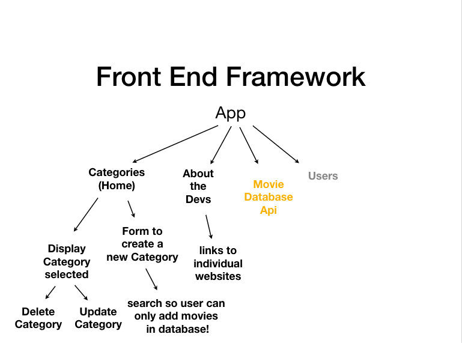

# trailerTracker

## Description

The Trailer Tracker app was created let users search an extensive database of movies, and organize them into *any* kind of category that the user wants to create.
- Favorite Movies
- Happy Movies
- Action Movies
- And More!

## Features

The app features three main pages; the Home page, the About page, and the New Category page.

- The Home page displays a customizable list of the categories that the user has chosen to group their chosen movies in. Once inside one of the categories, useres can click on a movie poster to be transported to the trailer for the chosen movie. Users can also delete that category, and update that category with movies from the database.

- The About page is a biographical page about the development team.

- The New Category page is where users can choose a name for their new category, search the database for movies that they like, then populate the category with their movies.

## Planning

> ## Wireframe Images
>
>  
> 
> 

The team initially decided to split into pairs and to divide the front end and back end duties evenly between the pairs.

## Technical Details

The front end of the app was built with:

- HTML
- React.js
- Axios
- CSS

The back end of the app was built with:

- Express.js
- MongoDB
- Mongoose
- Axios

The app was tested with Postman, GitHub was used for version control, and deployment was via Heroku.

## Issues

## Future Plans